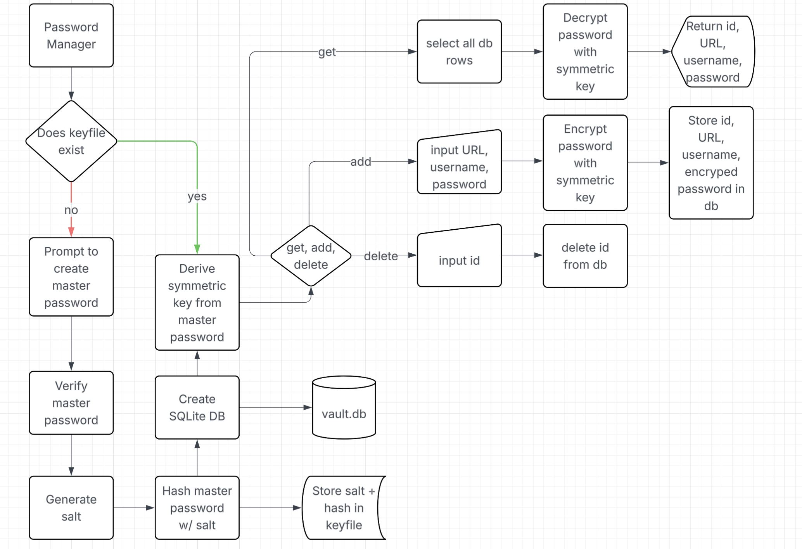

# LocalVault - Python Password Manager
**LocalVault** is a simple yet secure password manager built in C++. It allows you to store and manage your credentials locally, protected by encryption and a master password.

---

## Features
- Master password authentication (Argon2id-based hash)
- AES-256 encryption (via `libsodium`)
- Salted key derivation using libsodium's crypto_pwhash
- Encrypted local SQLite vault (`vault.db`)
- Add, retrieve, and delete credentials
- Strong random password generator

---

## Getting Started

### 1. Clone the Repository
```
git clone https://github.com/nick-graves/pwd-manager
cd pwd-manager
```

### 2. Build with Docker
```
docker build -t vault .
```

### 3. Run the App
```
docker run -it vault
```

## Workflow



## Project Strcture

```
pwd-manager/
├── main.cpp              # CLI entry point
├── vault_manager.cpp     # Manages vault logic and DB operations
├── vault_manager.h
├── crypto_utils.cpp      # Handles encryption, hashing, and key derivation
├── crypto_utils.h
├── password_utils.cpp    # Random password generation
├── password_utils.h
├── Dockerfile            # Build and run environment
```


## Security Details
- **Master password** is hashed using `Argon2id` and stored securely.
- A symmetric key is derived from the master password using `crypto_pwhash` and used to encrypt credentials.
- `ChaCha20-Poly1305` provides authenticated encryption, protecting both confidentiality and integrity.
- Salt is stored with the hash (in ```keyfile```) — safe and standard practice.
> The vault and keyfile are local only — no network or cloud storage involved.

